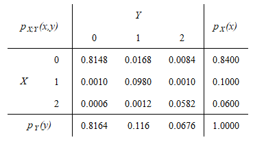

# Variables Aleatorias Multidimensionales {-}

<br>

## Ejercicios Guía de TP {-}

<br>

### E5.1 {-}

La calidad de un producto se determina de acuerdo al número de defectos que contiene. Sea $X$ la variable aleatoria que representa el número de defectos por unidad. Estos productos son sometidos a revisión. Sea $Y$ la variable aleatoria que representa el número de defectos por unidad detectados por el sistema de revisión. La distribución conjunta de probabilidades $p_{X,Y}$ se muestra en la siguiente tabla:  

<br>

```{r, echo=FALSE, fig.cap="Distribuciones de probabilidad conjunta y marginales", fig.align="center"}

```

<br>

**Planteo**  

* Se supone un proceso de producción que fabrica un producto dado y en cuya salida se puede conceptualizar una población de productos terminados, los cuales pueden someterse luego a una inspección de calidad.
* Un producto puede tener desde ninguno hasta lo sumo dos defectos reales, $R_{X}=\{0,1,2\}$
* El sistema de revisión puede identificar correctamente ninguno o todos los defectos reales, esto es, $R_{Y}=\{0,1,2\}$.

<br>

```{r, echo=FALSE, fig.cap="Planteo del ejercicio 5.1", fig.align="center"}
knitr::include_graphics("files/5.1_02.PNG")
```

<br>

**a)** Calcular $P(X > Y)$, $P(X = Y)$ y $P(X < Y)$. Expresar en forma literal que representan cada uno de los eventos cuyas probabilidades se han calculado.

El evento $X > Y$ representa la situación donde los defectos reales son mayores a los detectados por el sistema de revisión, es decir, son los falsos negativos que arroja el sistema (elementos por debajo de la diagonal de la tabla de sitribución conjunta):

$P(X > Y) = P[(X = 1 \cap Y = 0) \cup (X = 2 \cap Y = 0) \cup (X = 2 \cap Y = 1)]$

Como los eventos son disjuntos, es posible escribir:

$P(X > Y) = P(X = 1, Y = 0) + P(X = 2, Y = 0) + P(X = 2, Y = 1) \enspace \rightarrow \enspace \boxed{P(X > Y) = 0.0028}$

<br>

El evento $X = Y$ representa la situación donde los defectos reales son iguales a los detectados por el sistema de revisión, es decir, son los positivos verdaderos que arroja el sistema (elementos en la diagonal de la tabla de sitribución conjunta):

$P(X = Y) = P(X = 0, Y = 0) + P(X = 1, Y = 1) + P(X = 2, Y = 2) \enspace \rightarrow \enspace \boxed{P(X = Y) = 0.9710}$

<br>

El evento $X < Y$ representa la situación donde los defectos reales son menores a los detectados por el sistema de revisión, es decir, son los falsos positivos que arroja el sistema (elementos por arriba de la diagonal de la tabla de sitribución conjunta):

$P(X < Y) = P(X = 0, Y = 1) + P(X = 0, Y = 2) + P(X = 1, Y = 2) \enspace \rightarrow \enspace \boxed{P(X < Y) = 0.0262}$

<br>

```{r, echo=FALSE, fig.cap="Cálculo de eventos en la tabla de distribución conjunta", fig.align="center"}
knitr::include_graphics("files/5.1_03.PNG")
```

<br>

**b)** Encontrar la distribución marginal de $X$ y la correspondiente a $Y$.

Las distribuciones marginales $p_{X}(x)$ y $p_{Y}(y)$ se hallan en los márgenes (de allí su nombre) de la tabla de ditribución conjunta. Ya han sido calculadas y se indican en dicha tabla.

<br>

**c)** Determinar los valores esperados de $X$ y de $Y$, y las dispersiones de dichas variables.

Hallar lo pedido requiere simplemente plantear las definiciones de valor esperado y dispersión.

$E(X) = \mu_{X}  = \sum_{R_{X}}xp_{X}(x) \enspace \rightarrow \enspace \boxed{E(X) = 0.2200}$

$E(Y) = \mu_{Y} = \sum_{R_{Y}}yp_{Y}(y) \enspace \rightarrow \enspace \boxed{E(X) = 0.2512}$

$\sigma_{X} = +\sqrt{\sigma_{X}^2} = +\sqrt{E[(X - \mu_{X})^2]} = +\sqrt{E(X^2)-\mu_{X}^2} \enspace \rightarrow \enspace \boxed{\sigma_{X} = 0.5400}$

$\sigma_{Y} = +\sqrt{\sigma_{Y}^2} = +\sqrt{E[(Y - \mu_{Y})^2]} = +\sqrt{E(Y^2)-\mu_{Y}^2} \enspace \rightarrow \enspace \boxed{\sigma_{Y} = 0.5686}$

<br>

**d)** Evaluar las probabilidades condicionales definidas por $P(Y ≤ X | X = 1)$ y $P(Y ≤ X | X ≤ 1)$.

Al igual que en el punto anterior, para poder hallar lo pedido es suficiente con plantear la definición de probabilidad condicional de una distribución conjunta, y considerando luego que los eventos intervinientes son disjuntos:

$P(Y ≤ X | X = 1) = \frac{P(Y ≤ X) \cap P(X = 1)}{P(X = 1)} = \frac{p_{X,Y}(0,1) + p_{X,Y}(1,1)}{p_{X}(X = 1)} \enspace \rightarrow \enspace \boxed{P(Y ≤ X | X = 1) = 0.9900}$

$P(Y ≤ X | X ≤ 1) = \frac{P(Y ≤ X) \cap P(X ≤ 1)}{P(X ≤ 1)} = \frac{p_{X,Y}(0,0) +  p_{X,Y}(0,1) + p_{X,Y}(1,1)}{p_{X}(X ≤ 1)} \enspace \rightarrow \enspace \boxed{P(Y ≤ X | X ≤ 1) = 0.9721}$

<br>

**e)** Hallar el valor esperado de $X − Y$.

Dado que el valor esperado de una combinación lineal de variables aleatorias es igual a la combinación lineal de sus valores esperados, puede escribirse:

$E(X − Y) = E(X) - E(Y) \enspace \rightarrow \enspace \boxed{E(X − Y) = -0.0312}$

<br>

**f)** ¿Son las variables $X$ y $Y$ independientes?

Las variables aleatorias $X$ y $Y$ son dependientes si se verifica que para todo par $(x, y)$ se cumple que $p_{X,Y}(x, y) = p_{X}(x)p_{Y}(y)$. Como se desprende de la tabla de distribución de probabilidad conjunta, para el par $(X=0, Y=0)$ no se verifica la condición de independencia, por lo que dichas variables son dependientes. 

<br>

**g)** Hallar la matriz de covarianzas y el coeficiente de correlación de $(X,Y)$.

Nuevamente, para determinar lo pedido basta con aplicar la definición de los conceptos. Para la matriz de covarianzas, sólo resta calcular $COV(X,Y)$ dado que las varianzas de las variables aleatorias ya fueron calculadas en el punto c.

$COV(X,Y) = \sigma_{XY} = E[(X - \mu_{X})(Y - \mu_{Y})] = E(XY) - \mu_{X}\mu_{Y} \enspace \rightarrow \enspace \boxed{COV(X,Y) = 0.2799}$

<br>

$\begin{split}\Sigma = \begin{vmatrix} \sigma_{X}^2 & \sigma_{XY} \\ \sigma_{YX} & \sigma_{Y}^2 \\ \end{vmatrix} \enspace \rightarrow \enspace \boxed{\Sigma = \begin{vmatrix} 0.2916 & 0.2799 \\ 0.2799 & 0.3233 \\ \end{vmatrix}}\end{split}$

<br>

$\rho_{XY} = \frac{\sigma_{XY}}{\sigma_{X}\sigma_{Y}} \enspace \rightarrow \enspace \boxed{\rho_{XY} = 0.9117}$