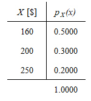
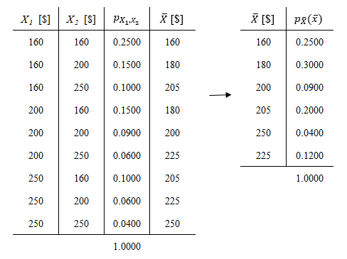

# Distribución del muestreo y Teorema Central del Límite {-}

<br>

## Ejercicios Guía de TP {-}

<br>

### E6.1 {-}

Un vendedor ofrece de un mismo producto, tres calidades diferentes. De todos los clientes que compran un sólo artículo, el 20% compra el de más alta calidad cuyo costo es de \$250, el 30% compra de calidad media cuyo costo es de \$200, y el 50% restante compra el de más baja calidad cuyo costo es de \$160. Sea $X$ el pago efectuado por un cliente seleccionado al azar que se lleva un sólo artículo.

<br>

**Planteo**  

* $X$: _Variable aleatoria discreta_ que representa el pago efectuado por un cliente seleccionado al azar que adquiere un solo artículo, $[X] = $$

<br>

**a)** Obtener la distribución de probabilidad puntual de $X$ y hallar $E(X) = \mu$ y $V(X) = \sigma^2$.

La obtención de la distribución de probabilidad puntual de $X$, $p_{X}(x)$, no presenta dificultad dado que se halla definida en el enunciado, mientras que el valor esperado y la varianza de $X$ se obtienen sencillamente aplicando la definición de las mismas.

```{r, echo=FALSE, fig.cap="Distribución de probabilidad puntual de $X$", fig.align="center"}

```

<br>

$E(X) = \mu_{X}  = \sum_{R_{X}}xp_{X}(x) \enspace \rightarrow \enspace \boxed{E(X) = 190\$}$

$V(X) = \sigma_{X}^2 = E[(X - \mu_{X})^2] = E(X^2)-\mu_{X}^2 \enspace \rightarrow \enspace \boxed{V(X) = 1,200\$^2}$

<br>

**b)** Se considera ahora una muestra aleatoria de tamaño 2, esto es el conjunto de dos variables aleatorias independientes e idénticamente distribuidas, $X_1$ y $X_2$, correspondiente a los pagos efectuados por dos clientes. Determinar la distribución de probabilidad puntual del promedio muestral $\overline{X} = \frac{X_1 + X_2}{2}$. Calcular $E(\overline{X})$ y comparar con $\mu_X$.

Es posible obtener la distribución de probabilidad de $\overline{X}$ en tres pasos:

  1. Determinar la distribución de probabilidad conjunta de las variables de la muestra, $P(X_1 = x_1, X_2 = x_2) = p_{X_1, X_2} = (x_1, x_2)$. Aquí es importante notar que dado que las muestras son independientes entre sí puede escribirse:
  $$P(X_1 = x_1, X_2 = x_2) = P(X_1 = x_1 \cap X_2 = x_2) = P(X_1 = x_1)P(X_2 = x_2) = p(x_1)p(x_2)$$

  2.  Calcular la nueva variable aleatoria, que en este caso es simplemente una combinación lineal de las variables de la muestra, $\overline{X} = \frac{X_1 + X_2}{2}$

  3. Determinar el recorrido de $\overline{X}$ y sumar las probabilidades de los pares $(X_1, X_2)$ que posean la misma media.

<br>

```{r, echo=FALSE, fig.cap="Distribución de probabilidad de la media muestral $\\overline{X}$", fig.align="center"}

```

<br>

El valor esperado de $\overline{X}$ se obtiene sencillamente aplicando la definición, y se observa que coincide con la media de $X$, $\mu_X$:

$E(\overline{X}) = \mu_{\overline{X}}  = \sum_{R_{\overline{X}}}xp_{\overline{X}}(\overline{x}) = 190\$ \enspace \rightarrow \enspace \boxed{E(\overline{X}) = \mu_{X}}$

<br>

### E6.6 {-}

**a)** Sea $X$ una variable aleatoria binomial con parámetros $n = 36$ y $p = 0,5$. Calcular el valor de $P(X ≤ 21)$ y comparar con él, el valor aproximado utilizando el teorema central del límite con y sin la corrección de medio punto.  

<br>

**Planteo**

